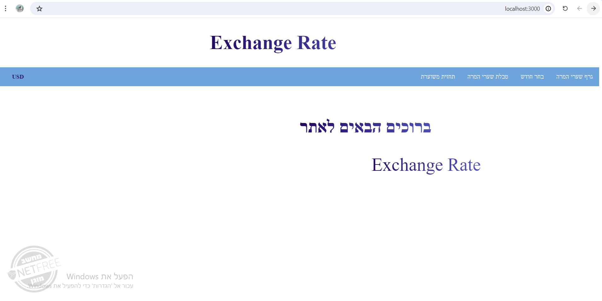
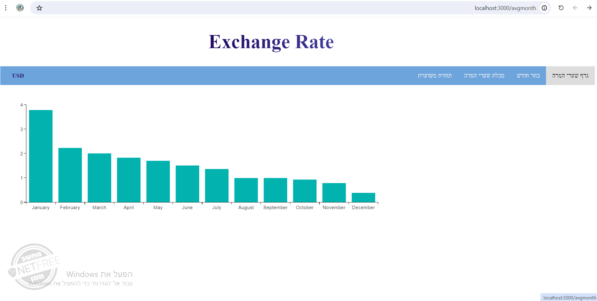
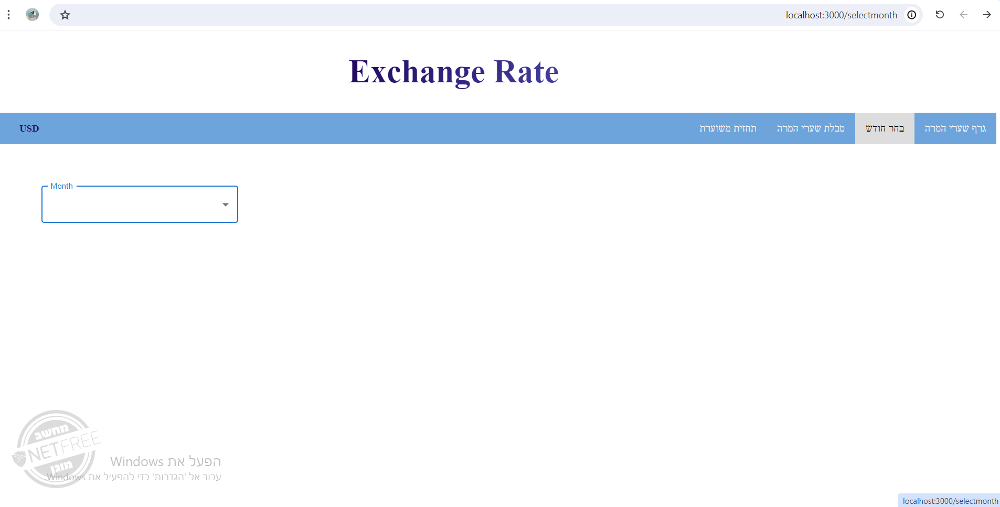
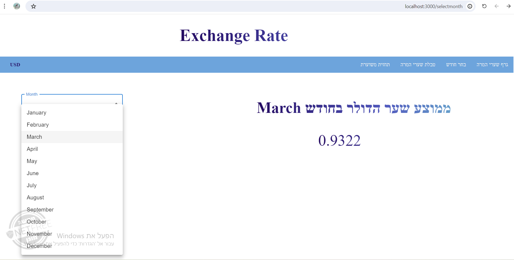
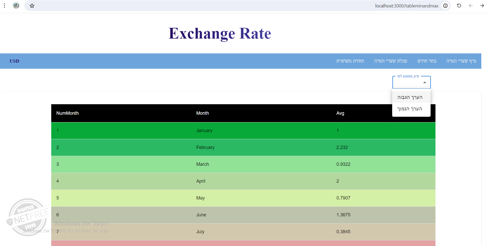
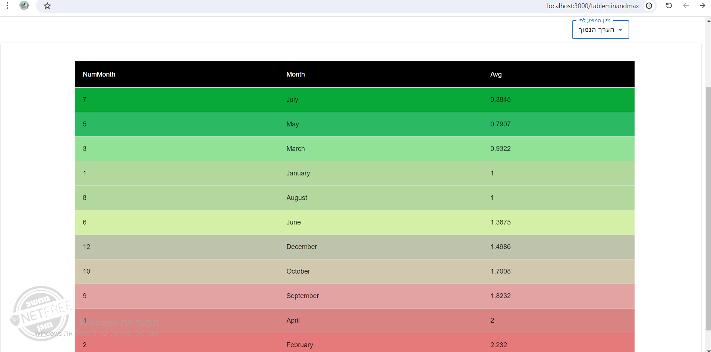
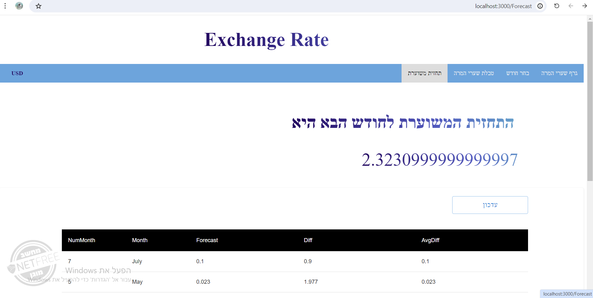
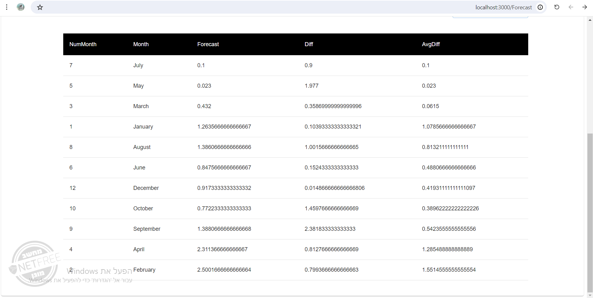
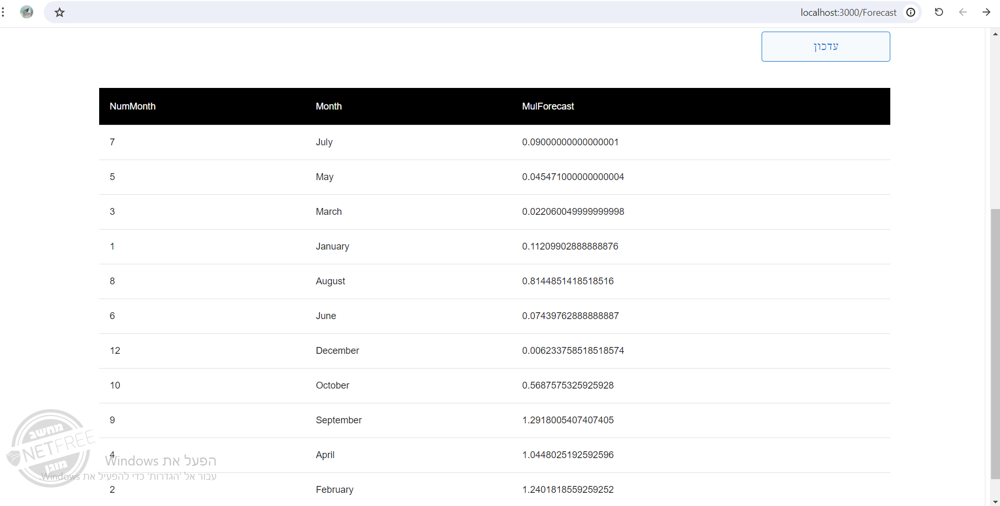

# ExchangeRates
In this project we will present information about conversion rates. The project consists of a server side in Node and a client side in React. When the project is activated, a website containing graphs and tables according to the average conversion rates will be displayed and will provide the requested information.

## Explanation of the database connection process

**step 1**
I signed up for mongoDB Atlas through the website:
https://www.mongodb.com/cloud/atlas/register

**step 2**
I downloaded mongoDB compass 
which is actually my local database that is connected to the cloud
mongoDB Atlas

**step 3**
I copied the connection from the cloud to the local repository.

## Bringing the data from API EXCHANGE RATE

**step 1**
I signed up for API EXCHANGE RATE
From the website: https://app.exchangerate-api.com/dashboard
And I got API keys

**step 2**
The data of the coins can now be accessed with my key in
URL: https://v6.exchangerate-api.com/v6/{myKey}/latest/USD

## My Websit

**When loading the site, the home page will be displayed**

**A graph showing the average conversion rates each month**

**Displaying the average conversion rate by month selection**

**A colored table showing the information in which each line is colored**
**from red to green according to the average rating of the conversion rate**
**with the option of choosing from the highest to the lowest or vice versa**

**Displaying the forecast for the next month based on the average of the previous three months**

**A table showing all the information about the forecast such as the difference between the forecast and what the rate actually was**

**When you click on update, the updated information consisting of the multiplication of the matrices will be displayed**

